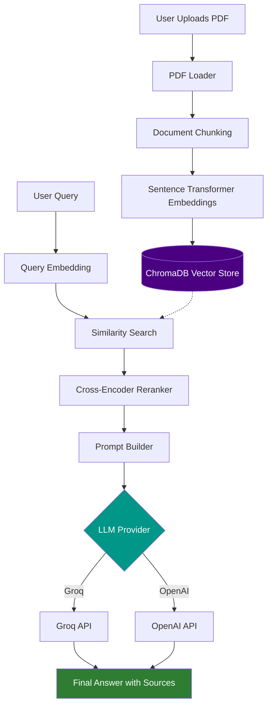

<div align="center">

# 🔎 ResearchRAG

**A production-ready Retrieval-Augmented Generation system for research papers.**

Upload PDFs → build a semantic vector index → retrieve, rerank, and generate grounded, citation-backed answers.

[](https://www.python.org/)
[](https://fastapi.tiangolo.com/)
[](https://www.trychroma.com/)
[](https://www.langchain.com/)
[](https://pytorch.org/)
[](LICENSE)
[](#contributing)

</div>

---

## Introduction

Large language models are powerful, but they don't know what's inside *your* research papers, and they're prone to confidently inventing citations they've never seen. **ResearchRAG** solves this by grounding every generated answer in retrieved content from a document collection you control.

Upload a PDF, and ResearchRAG parses it, splits it into semantically coherent chunks, embeds those chunks with a sentence-transformer model, and persists them in a local vector database. When you ask a question, ResearchRAG embeds your query, retrieves the most relevant chunks, reranks them with a cross-encoder for precision, and passes only the most relevant context to an LLM — producing an answer that is traceable back to its source material rather than fabricated from the model's parametric memory.

It's built as a reference implementation of RAG engineering done properly: clear module boundaries, a provider-agnostic embedding and LLM layer, a dedicated reranking stage, and a REST API designed for real deployment — not a single-file notebook script.

---

## Demo

<div align="center">

*Screenshots and a demo GIF go here.*

| Upload & Indexing | Query & Answer |
|---|---|
| `docs/assets/upload-demo.png` | `docs/assets/query-demo.png` |

</div>

<details>
<summary><strong>📹 Demo GIF (placeholder)</strong></summary>
<br>

`docs/assets/demo.gif`

</details>

---

## Features

- 📄 **PDF Upload** — ingest research papers directly via the API
- 🧹 **Automatic PDF Parsing** — text and metadata extraction from uploaded documents
- ✂️ **Intelligent Document Chunking** — configurable, retrieval-sized text splitting
- 🧠 **Semantic Embeddings** — dense vector representations via Sentence Transformers
- 💾 **Persistent Vector Store** — ChromaDB-backed storage that survives restarts
- 🔍 **Semantic Similarity Search** — top-k retrieval over the embedded corpus
- 🎯 **Cross-Encoder Reranking** — a second-pass relevance model that sharpens retrieval precision
- 🔗 **Retrieval-Augmented Generation** — answers grounded in retrieved source chunks
- 🔄 **Multiple LLM Provider Support** — Groq and OpenAI, selectable via configuration
- ⚡ **REST API** — a FastAPI backend with interactive OpenAPI documentation
- 🖥️ **Interactive Web Interface** — browse and exercise the API through the built-in Swagger UI
- ⚙️ **Configurable Architecture** — chunk size, retrieval depth, models, and providers are all configuration-driven
- 🧩 **Modular Project Structure** — loaders, embeddings, vector stores, and LLMs are each independently swappable

---

## Architecture



ResearchRAG operates as two independent flows sharing a common vector store: an **ingestion path** (PDF → chunks → embeddings → ChromaDB) and a **query path** (question → retrieval → reranking → generation). Ingestion can run at any time without interrupting query serving.

---

## Project Structure

```
ResearchRAG/
├── src/
│   ├── api/                  # FastAPI routes and dependency injection
│   ├── config/                # Centralized settings and logging
│   │   ├── settings.py
│   │   └── logging_config.py
│   ├── loaders/                # Document loading (PDFLoader, BaseLoader)
│   ├── preprocessing/           # Metadata handling and chunking
│   │   ├── metadata.py
│   │   └── splitter.py
│   ├── embeddings/               # Embedding provider abstraction
│   │   ├── base_embedding.py
│   │   ├── sentence_transformer.py
│   │   └── embedding_manager.py
│   ├── vectorstores/               # Vector database abstraction
│   │   ├── base_vectorstore.py
│   │   ├── chroma_store.py
│   │   └── index_manager.py
│   ├── retrieval/                    # Retrieval and reranking
│   │   ├── retriever.py
│   │   └── reranker.py
│   ├── llms/                          # LLM provider abstraction
│   │   ├── base_llm.py
│   │   └── llm_factory.py
│   └── pipelines/                       # High-level orchestration
│       ├── indexing_pipeline.py
│       ├── retrieval_pipeline.py
│       └── rag_pipeline.py
├── tests/
│   ├── unit/
│   └── integration/
├── docs/
│   └── architecture.md
├── data/                  # Local sample/test documents
├── requirements.txt
├── .env.example
└── README.md
```

---

## Installation

### Prerequisites

- Python 3.10+
- pip
- (Optional) A virtual environment tool such as `venv` or `conda`

### 1. Clone the repository

```bash
git clone https://github.com/<your-username>/ResearchRAG.git
cd ResearchRAG
```

### 2. Create a virtual environment

```bash
python -m venv venv
source venv/bin/activate      # On Windows: venv\Scripts\activate
```

### 3. Install dependencies

```bash
pip install -r requirements.txt
```

---

## Environment Variables

Create a `.env` file in the project root based on the template below:

```bash
cp .env.example .env
```

<details>
<summary><strong>📄 .env.example</strong></summary>

```env
# ── Application ───────────────────────────────
APP_NAME=ResearchRAG
APP_ENVIRONMENT=development
APP_DEBUG=false

# ── Paths ─────────────────────────────────────
PATH_DATA_DIR=data
PATH_RAW_DOCUMENTS_DIR=data/raw
PATH_VECTOR_DB_DIR=data/vectorstore
PATH_LOGS_DIR=logs

# ── Embeddings ────────────────────────────────
EMBEDDING_PROVIDER=sentence-transformers
EMBEDDING_MODEL=all-MiniLM-L6-v2
EMBEDDING_BATCH_SIZE=32

# ── Vector Store ──────────────────────────────
VECTOR_STORE_PROVIDER=chromadb
VECTOR_STORE_COLLECTION_NAME=research_documents

# ── Chunking ──────────────────────────────────
CHUNKING_CHUNK_SIZE=1000
CHUNKING_CHUNK_OVERLAP=200

# ── Retrieval ─────────────────────────────────
RETRIEVAL_TOP_K=5
RETRIEVAL_SIMILARITY_THRESHOLD=0.0
RETRIEVAL_RERANKER_MODEL=cross-encoder/ms-marco-MiniLM-L-6-v2

# ── LLM ────────────────────────────────────────
LLM_PROVIDER=groq
LLM_MODEL=llama-3.1-8b-instant
LLM_TEMPERATURE=0.2
LLM_MAX_TOKENS=1024

# ── API Keys (required — no defaults) ──────────
GROQ_API_KEY=your_groq_api_key_here
OPENAI_API_KEY=your_openai_api_key_here
```

</details>

> **Note:** API keys are never given default values. Only the provider you select (`LLM_PROVIDER`) needs a corresponding key populated.

---

## Running the Backend

Start the FastAPI server with Uvicorn:

```bash
uvicorn src.api.main:app --reload --host 0.0.0.0 --port 8000
```

The API will be available at `http://localhost:8000`.

---

## Running the Frontend

ResearchRAG ships with an interactive interface generated automatically by FastAPI — no separate frontend build step is required.

```bash
# With the backend running, open in your browser:
http://localhost:8000/docs      # Swagger UI
http://localhost:8000/redoc     # ReDoc
```

From the Swagger UI you can upload PDFs, trigger indexing, and submit queries directly against the running API.

---

## API Endpoints

| Method | Endpoint | Description |
|--------|----------|-------------|
| `GET` | `/health` | Health check for the API and its dependent services. |
| `POST` | `/documents/upload` | Upload one or more PDF files for ingestion. |
| `POST` | `/documents/index` | Trigger the indexing pipeline for uploaded documents. |
| `GET` | `/documents` | List documents currently stored in the vector index. |
| `DELETE` | `/documents/{document_id}` | Remove a specific document from the vector index. |
| `POST` | `/query` | Submit a natural language question and receive a generated, source-cited answer. |
| `GET` | `/query/{query_id}` | Retrieve a previously generated response by ID (if persistence is enabled). |
| `GET` | `/stats` | Retrieve indexing and vector store statistics. |

> Full request/response schemas are available via the interactive Swagger UI at `/docs`.

---

## Example Usage

### Upload a document

```bash
curl -X POST http://localhost:8000/documents/upload \
  -F "file=@./papers/attention_is_all_you_need.pdf"
```

### Ask a question

```bash
curl -X POST http://localhost:8000/query \
  -H "Content-Type: application/json" \
  -d '{
        "question": "What mechanism does the paper introduce to replace recurrence?"
      }'
```

### Example response

```json
{
  "answer": "The paper introduces the self-attention mechanism...",
  "sources": [
    {
      "source_file": "attention_is_all_you_need.pdf",
      "page": 2,
      "score": 0.87
    }
  ]
}
```

---

## Technologies Used

| Category | Technology |
|---|---|
| Language | Python |
| API Framework | FastAPI |
| Vector Database | ChromaDB |
| Embedding Model | Sentence Transformers (`all-MiniLM-L6-v2`) |
| Reranker | Cross-Encoder (`ms-marco-MiniLM-L-6-v2`) |
| LLM Providers | Groq API, OpenAI (optional) |
| Orchestration | LangChain |
| Data Validation | Pydantic |
| ASGI Server | Uvicorn |
| Tensor Computation | PyTorch |

---

## RAG Pipeline Explanation

Retrieval-Augmented Generation addresses a core weakness of LLMs: they cannot know the contents of documents outside their training data, and they will often generate plausible-sounding but incorrect information when asked about such content. ResearchRAG's pipeline is designed to keep generation grounded at every step:

1. **Ingestion.** An uploaded PDF is parsed page-by-page, cleaned, and split into overlapping chunks small enough to embed meaningfully but large enough to preserve context.
2. **Embedding.** Each chunk is converted into a dense vector using a Sentence Transformers model (`all-MiniLM-L6-v2`), capturing its semantic meaning rather than just its keywords.
3. **Indexing.** Chunks and their vectors are persisted in ChromaDB, along with metadata (source file, page number, chunk position) needed to trace an answer back to its origin.
4. **Query embedding.** A user's question is embedded using the same model, placing it in the same vector space as the indexed chunks.
5. **Similarity search.** ChromaDB returns the top candidate chunks whose embeddings are closest to the query embedding.
6. **Reranking.** A cross-encoder (`ms-marco-MiniLM-L-6-v2`) jointly scores the query against each candidate chunk — a slower but more precise relevance signal than embedding similarity alone — and reorders the candidates accordingly.
7. **Prompt construction.** The top reranked chunks are assembled into a context block alongside the user's question and system instructions.
8. **Generation.** The assembled prompt is sent to the configured LLM provider (Groq or OpenAI), which generates an answer conditioned on the retrieved context.
9. **Response.** The final answer is returned along with the source chunks used to produce it, so the answer's grounding is inspectable rather than opaque.

---

## Configuration

All runtime behavior is controlled through environment variables (see [Environment Variables](#environment-variables)), loaded via a centralized Pydantic settings module. Key parameters:

| Setting | Purpose |
|---|---|
| `CHUNKING_CHUNK_SIZE` / `CHUNKING_CHUNK_OVERLAP` | Controls how documents are split before embedding. |
| `EMBEDDING_MODEL` | Selects the Sentence Transformers model used for embeddings. |
| `RETRIEVAL_TOP_K` | Number of chunks retrieved before reranking. |
| `RETRIEVAL_RERANKER_MODEL` | Cross-encoder model used for reranking retrieved chunks. |
| `LLM_PROVIDER` / `LLM_MODEL` | Selects the generation backend and model. |

No code changes are required to adjust these — configuration is the only surface that needs to change.

---

## Performance Notes

- Embedding generation runs on CPU by default; a CUDA-capable GPU (via PyTorch) will meaningfully speed up both embedding and reranking for large document collections.
- Cross-encoder reranking is more computationally expensive than the initial similarity search, so it is applied only to the top-k retrieved candidates rather than the full corpus.
- ChromaDB persistence uses local disk storage; indexing throughput and query latency scale with corpus size and available I/O and memory.

---

## Future Improvements

- [ ] Hybrid search (dense + keyword/BM25)
- [ ] Metadata-based filtering during retrieval
- [ ] Multi-query retrieval and query expansion
- [ ] Streaming LLM responses
- [ ] Automated retrieval and answer-quality evaluation
- [ ] Docker-based deployment
- [ ] Support for additional document formats (DOCX, HTML)

---

## Contributing

Contributions are welcome. Before submitting a change:

1. Open an issue describing the proposed change or bug, if one doesn't already exist.
2. Fork the repository and create a feature branch from `main`.
3. Follow the existing code style (type hints, docstrings, centralized logging).
4. Add or update tests for any behavioral change.
5. Ensure the test suite passes locally before opening a pull request.
6. Submit a pull request describing the change and its motivation.

---

## License

This project is licensed under the [MIT License](LICENSE).

---

## Acknowledgements

ResearchRAG builds on ideas and tools from the open-source machine learning and information retrieval community, including Sentence Transformers, cross-encoder reranking research, and the broader RAG literature. This project is independently developed and is not affiliated with any of the organizations whose tools or research it builds upon.

---

## Contact

For questions, issues, or feedback, please open an [issue](https://github.com/<your-username>/ResearchRAG/issues) on this repository.
